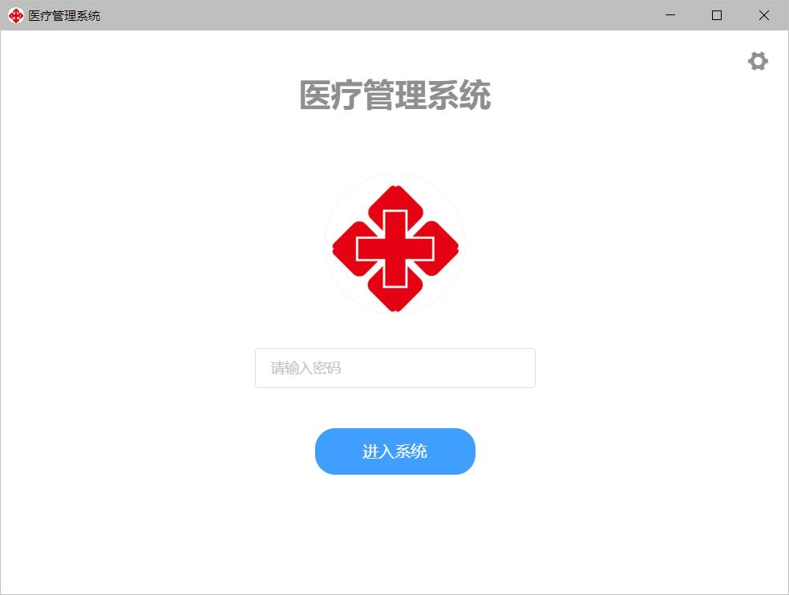
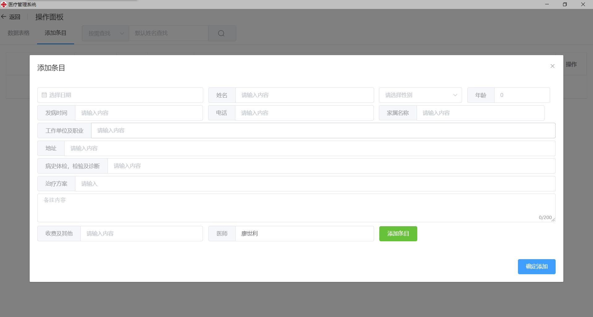
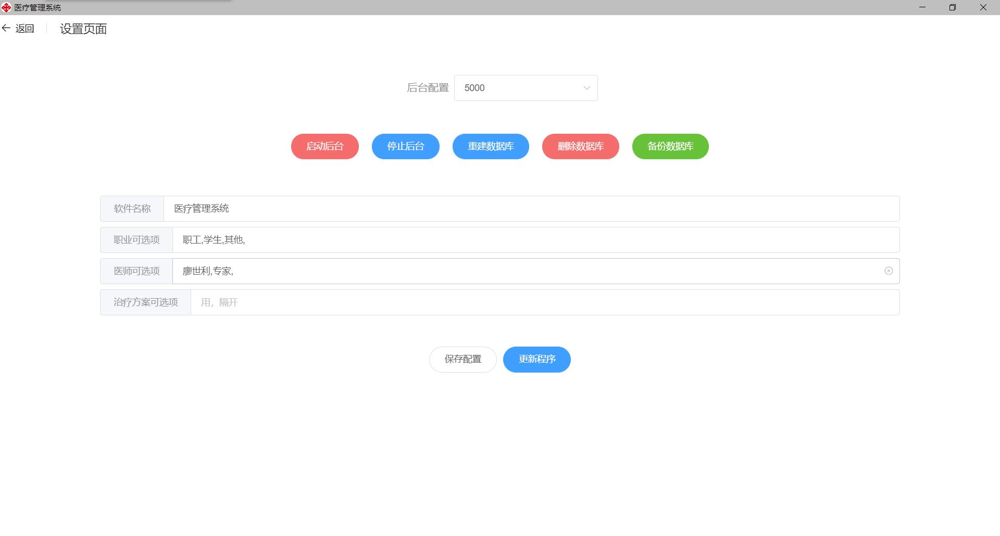

# pigform

## Project setup
```
yarn install
```

### Compiles and hot-reloads for development
```
yarn serve
```

### Compiles and minifies for production
```
yarn build
```

### Customize configuration
See [Configuration Reference](https://cli.vuejs.org/config/).

## 医疗卫生管理系统

**build状态**

- ❤ 开源MIT许可
- 🍀Vue CLI版本@4.3.0
- 🔨Python后端及数据库组件 编译通过
- 🔨Update更新组件编译通过

### 运行此程序

```bash
electron:serve
#发布
electron:build
```

### 运行页面







### 功能介绍

#### 设置页面

支持从主页进入设置或从windows的托盘右键打开设置。设置文件为`config.json`

在程序首次运行时会检测是否存在配置文件，不存在则创建

```json
{
  "appname": "医疗管理系统",
  "port": "5000",
  "work": [
    {
      "value": "职工"
    },
    {
      "value": "学生"
    },
    {
      "value": "其他"
    }
  ],
  "doc": [
    {
      "value": "xxx"
    },
    {
      "value": "专家"
    }
  ],
  "solution": []
}
```

配置项支持自定义首页名称，运行端口，和添加条目时的自动补全项

#### 数据库

数据库基础了基于文件的sqlite3，在首次运行时会自动创建数据库文件。

数据库名称格式`pig.db`

#### 数据库的自动备份

为优化运行内存占用，未添加自动备份功能。用户可以在设置页面自行备份数据库

备份分为两种：

- 保留当前数据的备份
- 清除当前数据的备份

备份文件会保存为`/backup/pig-YYYY-MM-DD.db`的格式

#### 更新程序

支持更新编译后的asar文件，没有使用electron-updater模块所以不支持热更新

#### 调试模式

在windows托盘里右键该程序的**调试模式**选项，即可进入调试模式